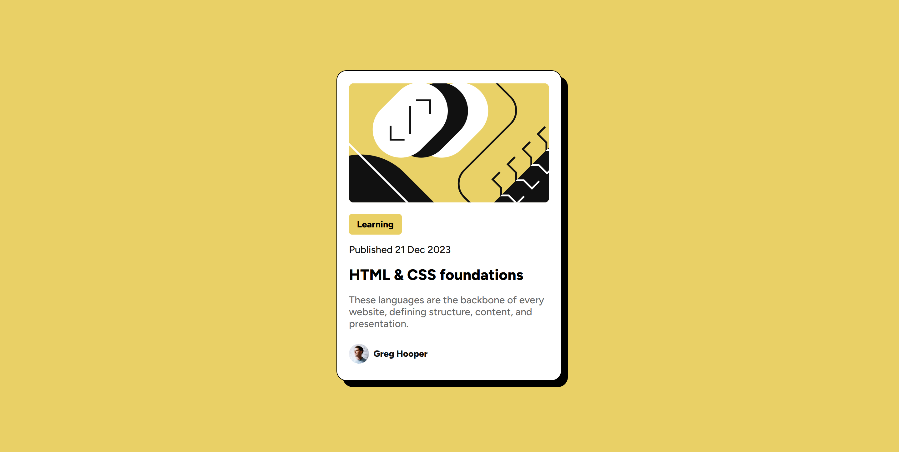

# Frontend Mentor - Blog preview card solution

This is a solution to the [Blog preview card challenge on Frontend Mentor](https://www.frontendmentor.io/challenges/blog-preview-card-ckPaj01IcS). Frontend Mentor challenges help you improve your coding skills by building realistic projects. 

## Table of contents

- [Overview](#overview)
  - [The challenge](#the-challenge)
  - [Screenshot](#screenshot)
  - [Links](#links)
- [My process](#my-process)
  - [Built with](#built-with)
  - [What I learned](#what-i-learned)
  - [Useful resources](#useful-resources)
- [Author](#author)

## Overview

### The challenge

Users should be able to:

- See hover and focus states for all interactive elements on the page

### Screenshot

### Links

- Live Site URL: [GitHub Pages](https://merleezy.github.io/blog-preview-card/)

## My process

### Built with

- Semantic HTML5 markup
- CSS custom properties
- Flexbox
- CSS Grid
- Mobile-first workflow

### What I learned

While I didn't learn any new coding concepts while building this project, I did get to practice my CSS skills and improve my workflow. I also got to practice using GitHub Pages to deploy my project, which was a great learning experience.

### Useful resources

- [MDN](https://developer.mozilla.org/) - This is an amazing resource for learning and referencing web development concepts.

## Author

- Frontend Mentor - [@merleezy](https://www.frontendmentor.io/profile/merleezy)
- Twitter - [@merleezy_](https://www.twitter.com/merleezy_)